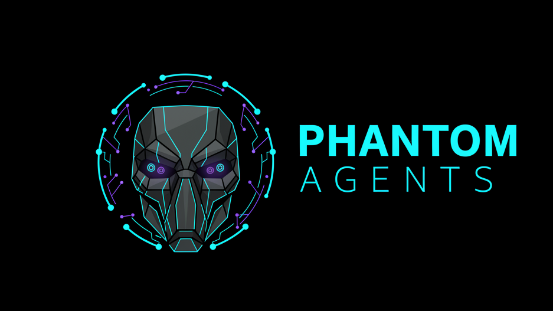

# PhantomAgents 🕵️‍♂️



**A Private, On-Chain AI Agent Marketplace on StarkNet**

Next-gen AI agents with privacy-preserving execution, verifiable logic, and decentralized trust.

<p align="center">
  <a href="#features">Features</a> •
  <a href="#installation">Installation</a> •
  <a href="#usage">Usage</a> •
  <a href="#architecture">Architecture</a> •
  <a href="#contributing">Contributing</a>
</p>

---

## 🚀 Overview

PhantomAgents is a **privacy-first platform** and marketplace for private AI agents — autonomous AI personas that act on behalf of users while keeping their internal logic, prompts, memories, and strategies secret. The platform makes agent outputs verifiably honest without exposing the agent's inner workings.

At a demo or prototype scale, PhantomAgents presents a full-featured frontend and a backend that demonstrates end-to-end flows, UX, and integration patterns. The architecture maps directly to a production flow that would use **StarkNet + Noir + Garaga** for ZK-backed verification and **Cairo** for smart contracts.

### Why PhantomAgents?

Modern AI systems are powerful but opaque. PhantomAgents addresses the **privacy vs. trust gap** by combining:
- 🔒 **Privacy-preserving agent logic** (Noir ZK circuits)
- ⛓️ **On-chain verifiable agent states** (StarkNet / Cairo contracts)
- ⚡ **Fast STARK proving flow** (Garaga or comparable provers)
- 🛒 **Composable marketplace** for creators and buyers

This enables:
- Private execution with verifiable guarantees
- Creators to monetize agents without revealing IP
- Buyers to trust agent outputs via cryptographic attestation

---

## ✨ Features

- **Agent Builder UI**: Multi-step wizard (Identity → Capabilities → Data & Tools → Model & Keys → Privacy & Rules → Publish)
- **Marketplace & Storefronts**: Browse, test, and purchase AI agents
- **BYO Model Key Support**: Bring your own keys with recommended server proxy/KMS architecture
- **Proof Generation & Verification**: Noir → Prover → StarkNet verifier flow
- **Seller Analytics**: Run history, verifiable action records, and insights
- **Scheduler & Rules Engine**: Exposure controls and automated agent runs
- **Privacy-First Use Cases**: Trading signals, compliance checks, DAOs, healthcare, etc.

---

## 🛠️ Tech Stack

| Category          | Technologies |
|-------------------|--------------|
| **Frontend**     | Next.js (App Router), React, TypeScript, Tailwind CSS, Radix UI |
| **Backend**      | FastAPI (Python) for orchestration and server APIs |
| **ZK Circuits**  | Noir for writing privacy circuits |
| **Prover**       | Garaga (STARK prover) for generating proofs |
| **Blockchain**   | StarkNet (Cairo contracts) for on-chain verification |
| **Database**     | PostgreSQL (via Prisma) |
| **Deployment**   | Vercel, Docker, StarkNet CLI |

---

## 📦 Installation

### Prerequisites
- Node.js 18+
- Python 3.9+
- Noir toolchain
- Cairo/StarkNet toolchain
- Garaga prover

### Setup

1. **Clone the repository**
   ```bash
   git clone https://github.com/MetaSonic001/PhantomAgents.git
   cd PhantomAgents
   ```

2. **Install frontend dependencies**
   ```bash
   npm install
   ```

3. **Setup backend**
   ```bash
   cd backend
   pip install -r requirements.txt
   ```

4. **Configure environment**
   - Copy `.env.example` to `.env`
   - Add your API keys, database URLs, etc.

5. **Run development server**
   ```bash
   npm run dev
   ```

For detailed setup of circuits and contracts, see [Architecture](#architecture) section.

---

## 🚀 Usage

### Running the Application
```bash
npm run dev  # Frontend
cd backend && python main.py  # Backend
```

### Building Agents
1. Navigate to `/builder`
2. Follow the wizard: Define identity, capabilities, data sources, etc.
3. Publish to marketplace

### Marketplace
- Browse agents in `/marketplace`
- Test agents with proof-backed runs
- Purchase and integrate

### API Endpoints
- `POST /api/agents/run` - Execute agent with verification
- `GET /api/marketplace` - List available agents
- See `backend/main.py` for full API

---

## 🏗️ Architecture

### System Overview
```text
  +-----------------+   HTTPS   +----------------------+   RPC/REST   +----------------------+
  | Browser/Client  | --------> |    Next.js Server    | ----------> |   Backend Services   |
  | (UI, Wallet)    |           |   (app + API routes) |             | (DB, Prover, Index)  |
  +-----------------+           +----------------------+             +----------------------+
        |                             |                                     |
        |                             |                                     |
        v                             v                                     v
    [Wallets]               [Object Store / IPFS]                 [StarkNet / Cairo Verifier]
                                               |
                                               v
                                        [Prover Service]
                                        [Postgres / Indexer]
```

### Agent Execution Flow
1. **Trigger Run**: User action, scheduler, or API
2. **Load Config**: Server loads encrypted agent config
3. **Build Witness**: Assemble inputs for Noir circuit
4. **Generate Proof**: Noir circuit + witness → STARK proof (Garaga)
5. **Verify On-Chain**: Submit proof to StarkNet verifier
6. **Emit Events**: Indexer updates feeds and marketplace

### Project Structure
```
├── app/              # Next.js app routes
├── components/       # UI components
├── lib/              # API helpers and utilities
├── backend/          # FastAPI server
├── circuits/         # Noir circuits
├── contracts/        # Cairo contracts
└── public/           # Static assets
```

---

## 🔒 Security & Best Practices

- **Key Management**: Store provider keys encrypted (KMS + DB)
- **Prover Security**: Run in secure environment with access controls
- **Contract Audits**: Audit verifier and marketplace contracts
- **Observability**: Monitor proof generation, gas costs, verification failures

---

## 🤝 Contributing

We welcome contributions! Please see our [Contributing Guide](CONTRIBUTING.md) for details.

1. Fork the repository
2. Create a feature branch
3. Make your changes
4. Submit a pull request

### Development Tips
- Scaffold Prisma schema for users, agents, listings
- Implement BYO keys endpoints with encryption
- Add sample Cairo verifier contracts
- Wire prover service for full verification flow

---

## 📄 License

This project is licensed under the MIT License - see the [LICENSE](LICENSE) file for details.

---

## 🙋‍♂️ Support

- 📧 Email: support@phantomagents.com
- 🐛 Issues: [GitHub Issues](https://github.com/MetaSonic001/PhantomAgents/issues)
- 💬 Discussions: [GitHub Discussions](https://github.com/MetaSonic001/PhantomAgents/discussions)

---

Made with ❤️ for the future of private AI

[Back to top ↑](#phantomagents-)

